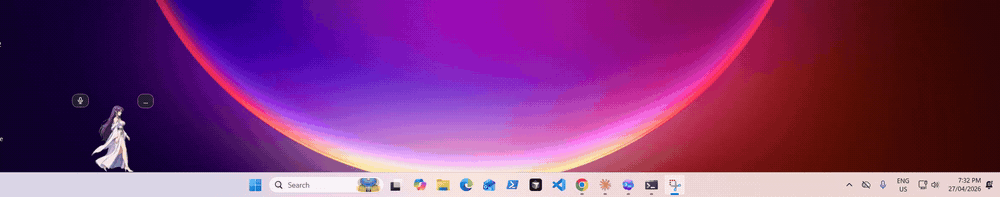

# Athena Windows Companion Demo

Athena is a transparent WPF desktop companion for Windows. She walks above the taskbar, can pause for voice mode, and can open a text chat mode with shared screen and image-generation tools.



## Music Mode

Athena can open a compact local music player from voice, text, or the tray menu. Put `.mp3` or `.m4a` files under:

```text
%USERPROFILE%\Music\Athena Companion
```

Music mode stops voice immediately, opens a minimalist player, and plays everything through a fixed mono AM/SW radio effect.

## Run

```powershell
dotnet run --project .\AthenaCompanion\AthenaCompanion.csproj
```

## Test

```powershell
dotnet test .\AthenaCompanion.sln
```

## Build Installer

```powershell
.\scripts\build-release.ps1 -Version 0.1.5
```

The installer is written to:

```text
artifacts\installer\AthenaCompanionSetup-0.1.5.exe
```

## GitHub Release

Push a version tag to build and publish a GitHub release:

```powershell
git tag v0.1.5
git push origin v0.1.5
```

The release workflow builds the Windows installer and attaches it to the tagged GitHub release.
